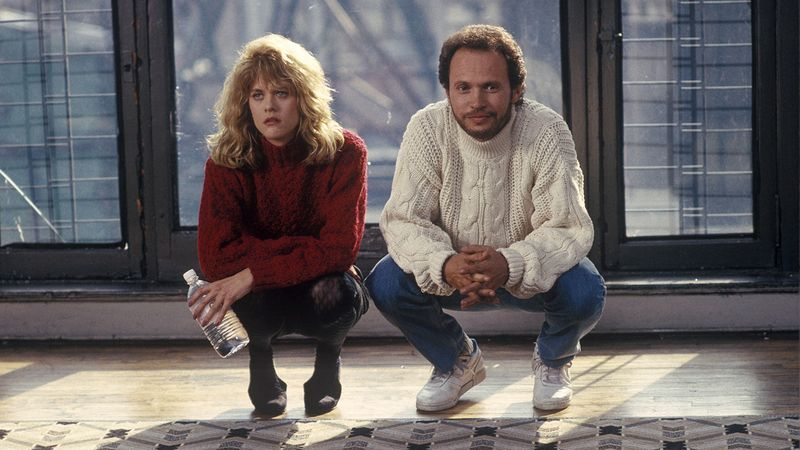
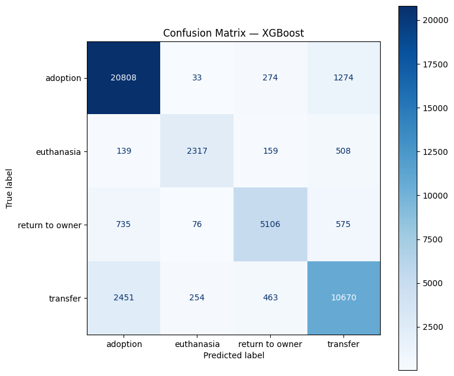
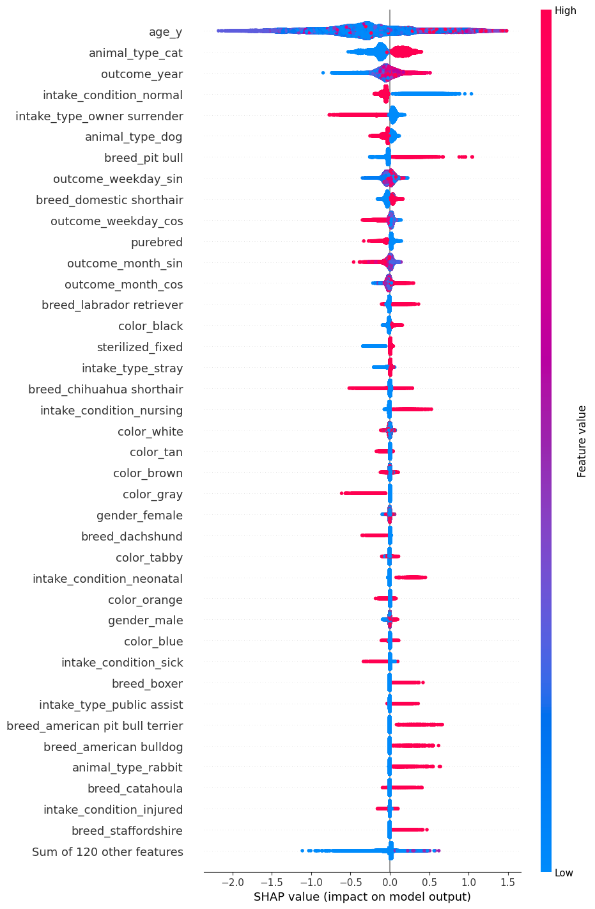
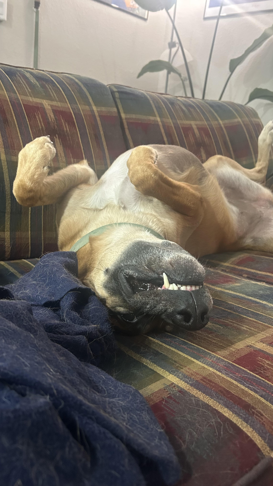
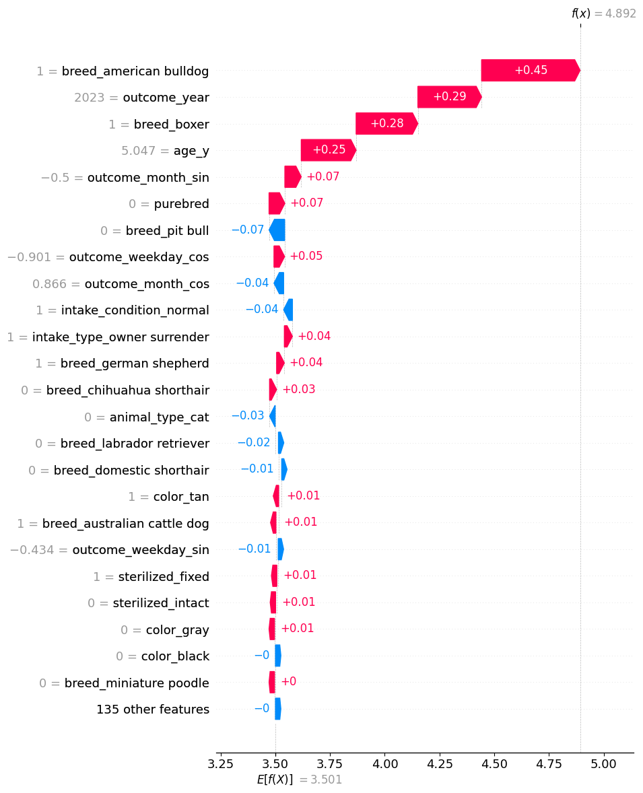
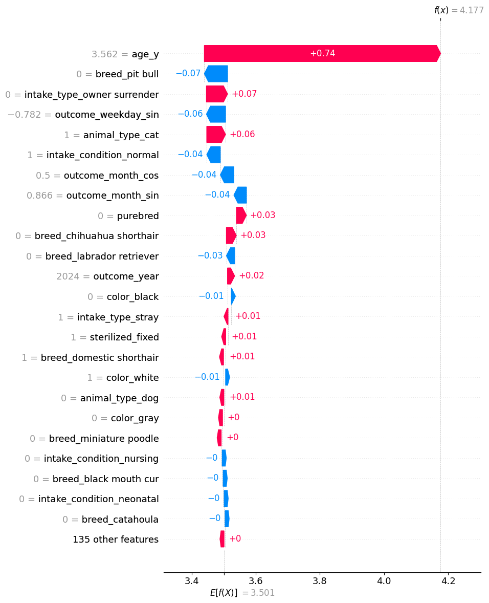

## Predicting Animal Shelter Outcomes

Joe Brady

MSBA – Machine Learning

Final Project Presentation

1

Drop It!

## Works Cited

Fit  inspo : 

Joe Brady \| University of Notre Dame \| MS Business Analytics

2

Billy Crystal

## Too many pets are not adopted or spend too long waiting in the shelter

We all know that some breeds are stereotypically favored (labradors), while some are not (pit bulls) 

people usually want puppies over senior dogs

How powerful are these factors? What else plays a role? Coat color? Time of year? 

3

Joe Brady \| University of Notre Dame \| MS Business Analytics

## I framed this problem as 3 questions to model

Predict the outcome of an animal (adoption, return to owner, transfer, or euthanasia)

Predict the  time it takes for an animal to be adopted

Identif y what are the strongest factors that make an animal more or less likely to be adopted

4

Joe Brady \| University of Notre Dame \| MS Business Analytics

## I framed this problem as 3 questions to model

Predict the outcome of an animal (adoption, return to owner, transfer, or euthanasia)

Tuned  XGBoost  multiclass model

Predict the  time it takes for an animal to be adopted

Tuned  XGBoost  gamma deviance model

Identif y what are the strongest factors that make an animal more or less likely to be adopted

non-tuned  XGBoost  logistic regression model

5

Joe Brady \| University of Notre Dame \| MS Business Analytics

## The dataset I used was from the Austin Animal Center, from 2013-2025

Cons

65,000 Duplicate animals

Similar data, but conflicting entries

entry error, or returning animal?

No behavioral data

likely a strong factor for adoption outcomes

Data is only from one location

model generalization might be limited

how does geography play a role?

Joe Brady \| University of Notre Dame \| MS Business Analytics

6

Pros

Large dataset, 220,000 rows!

65,000 are duplicates…

13 predictive features – breed, color, age, intake type, intake condition, and on

## The final cleaned dataset has 13 predictors and 2 response variables

Joe Brady \| University of Notre Dame \| MS Business Analytics

7

| Feature | Type | Description |
|----|----|----|
| animal type | Predictive | Dominated by dog and cat class; other animals are a minority |
| breed | Predictive | Examples: labrador retriever (dog), maine coon (cat), cottontail (rabbit) |
| purebred | Predictive | 1 or 0 depending on if the dog is only one breed or a mix of breeds |
| color | Predictive | Coat color; black, tan, brindle, etc |
| Intake reason | Predictive | Context for intake. stray, owner surrender, public assist, wildlife, etc |
| intake condition | Predictive | Any abnormalities upon intake. Normal, injured, nursing, etc. |
| age | Predictive | Age in years of the animal |
| gender | Predictive | Male, female, or unknown (usually unknowns are wildlife) |
| sterilization status | Predictive | Intact or sterilized (i.e. spayed/neutered) |
| Outcome year | Predictive | Year of outcome. Used to identify potential trend in outcomes |
| Outcome month | Predictive | Month of outcome. Used to identify potential seasonality in outcome. Transformed into sin and cos components |
| Outcome weekday | Predictive | Weekday of outcome. Used to identify potential seasonality within a week of outcomes. Example: a popular day for adoption |
| Shelter stay duration | Predictive/Response | Time between intake and outcome. Predictive for models where outcome type is the response variable. Response variable for one model. |
| Outcome type | Response | Outcome class: adoption, euthanasia, return to owner, transfer.  |

## Model 1 predicts outcome classification for animals

Training set accuracy: 98.6%

Test set accuracy: 84.9%

Factor strength difficult to extract for multiclass

 will be highlighted with other models

Joe Brady \| University of Notre Dame \| MS Business Analytics

8

## Model 2 predicts the time it takes until an animal gets adopted 

Training set gamma deviance: 15.59

Test set gamma deviance: 19.59

Null deviance: 40.33

Joe Brady \| University of Notre Dame \| MS Business Analytics

9

## What is gamma deviance?

Joe Brady \| University of Notre Dame \| MS Business Analytics

10

Good for datasets with response variables greater than 0 and right skew

wait times, insurance payouts, and shelter stays

Fails for data that is extremely right-skewed 

Null deviance – deviance if we just used the mean value of the response variable to guess

My model’s test deviance is 52% better than null – 52% better than a basic guess using the mean

## The most impactful features for the gamma deviance model

Joe Brady \| University of Notre Dame \| MS Business Analytics

11

older animals have longer stays

dogs are adopted quicker than cats

non-injured animals are adopted quicker

previously homed pets (‘owner surrender’) are adopted faster than strays

pit bulls and labs stay longer, and purebreds are adopted quicker

black coated animals stay longer

## Secondary impactful features for the gamma deviance model

Joe Brady \| University of Notre Dame \| MS Business Analytics

12

grey animals adopted quicker

dachshunds adopted quicker

boxers, bulldogs, staffies stay longer

rabbits stay longer

animals that are sick upon intake are adopted quicker

## What would the gamma deviance model predict for my dog, Athena?

Joe Brady \| University of Notre Dame \| MS Business Analytics

13

## Here’s Athena

Joe Brady \| University of Notre Dame \| MS Business Analytics

14

## Athena

Joe Brady \| University of Notre Dame \| MS Business Analytics

15

## Athena

Joe Brady \| University of Notre Dame \| MS Business Analytics

16

## Athena 

Joe Brady \| University of Notre Dame \| MS Business Analytics

17

## Athena

Joe Brady \| University of Notre Dame \| MS Business Analytics

18

## Uploading Athena into the model 

Joe Brady \| University of Notre Dame \| MS Business Analytics

19

## Athena’s predicted shelter stay based on the gamma deviance model 

Athena’s breeds increased her predicted stay significantly, as well as being a mixed breed

not being a pit bull decreased her predicted stay

 her older age predicted a longer stay

2023, Nov, & Friday predict a longer stay

Predicted shelter stay: 4.9 days

- Actual shelter stay: ~298 days  

Conclusion: The model is PERFECT and the World is WRONG

Joe Brady \| University of Notre Dame \| MS Business Analytics

20

## What about my friends’ pet cat, Mr. Chocolate Milk Mustache Face? 

Joe Brady \| University of Notre Dame \| MS Business Analytics

21

## Choccy’s predicted shelter stay based on the gamma deviance model 

Choccy’s age is the strongest factor, increasing his predicted stay

Not being a pit-bull decreased expected stay, while being a cat increased it

Not being an owner surrender increased expected stay

Outcome month of Feb, weekday Sunday decreased expected stay

Predicted shelter stay: 4.17 days

- Actual shelter stay: ~62 days  

In general,  the model  does not handle outliers very well

Joe Brady \| University of Notre Dame \| MS Business Analytics

22

## Model 3 looks only to identify the strongest factors that predict adoption. These are the strongest factors that predict an adoption outcome (top 20)

sterilization predicts adoption

shelter policy?

longer shelter stay predicts adoption

non-adoption outcomes happen quickly

previously homed animals more likely to be adopted

‘intake type: owner surrender’

cats and dogs both are less likely to be adopted, wildlife no adopted

other animals (birds, rabbits) skew

wildlife never adopted

females more likely to be adopted

pit bulls are again unfavored

Joe Brady \| University of Notre Dame \| MS Business Analytics

23

## Secondary factors that predict an adoption outcome (21-40)

Joe Brady \| University of Notre Dame \| MS Business Analytics

24

chihuahuas and labs are slightly more likely to be adopted, while shih tzus are much less likely

bats are NEVER adopted, while rabbits are more likely

 orange and point colored animals are more likely to be adopted

point coat example: Siamese cat

male animals are somewhat less likely to be adopted

sick animals are somewhat less likely to be adopted

large range of impact

## Recommendations for better shelter outcomes

Prioritize efforts for less desirable animals

pit bulls, black coat animals, bulldogs, boxers, older animals, males

Focus on basic training and socialization for strays

animals homed previously and used to people have better outcomes

Promote rabbits as pets, as rabbits tend to stay in a shelter longer

Consider introducing a wildlife rehabilitation &  release program,  as wildlife that end up in the animal shelter are almost  always euthanized

Joe Brady \| University of Notre Dame \| MS Business Analytics

25

## With more time, there are a few more things I would have liked to try

K-Means clustering to group animals and see trends

Modeling for just dogs and cats, who make up most of the dataset, and whose results people probably care about the most

Deal with more issues in the dataset

collinearity: e.g. animal type and breed, age and intake conditions (neonatal)

group breeds and coat colors into buckets for a more streamlined model

Remove time components from the model

It would be more meaningful to simply visualize these trends aggregated over time

Joe Brady \| University of Notre Dame \| MS Business Analytics

26

## Questions?

Joe Brady \| University of Notre Dame \| MS Business Analytics

27

Consider adopting an animal once that signing bonus cashes!
